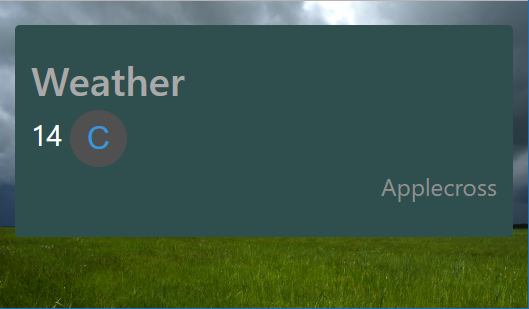

# Weather Site
Free Code Camp - Show the Local Weather

## Purpose - Display Local Weather
https://www.freecodecamp.com/challenges/show-the-local-weather

## Here are the specific user stories you should implement for this project

User Story: I can see the weather in my current location.

User Story: I can see a different icon or background image (e.g. snowy mountain, hot desert) depending on the weather.

User Story: I can push a button to toggle between Fahrenheit and Celsius.
